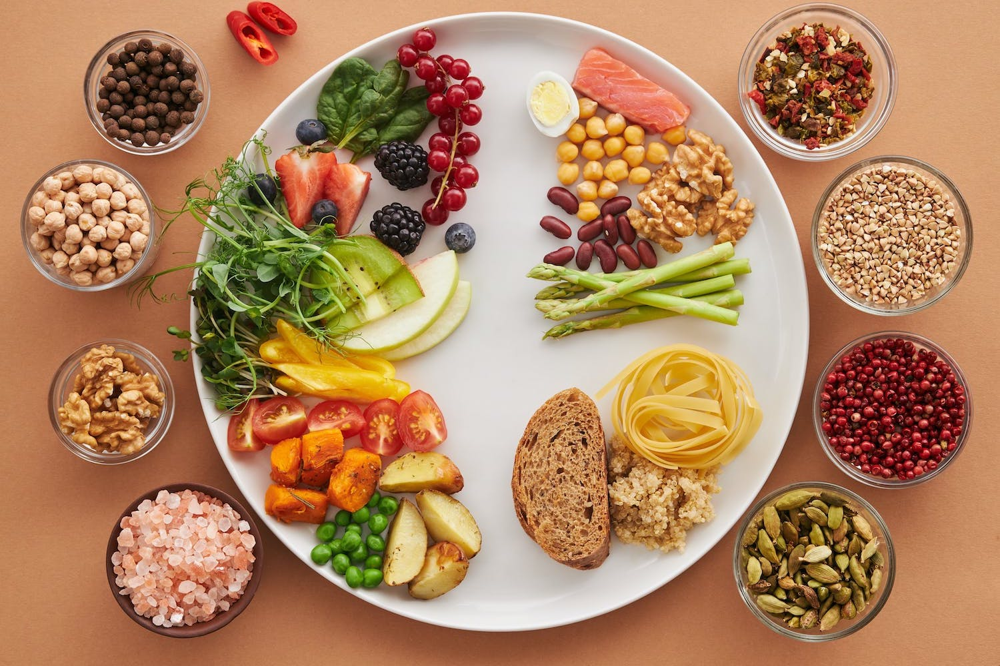
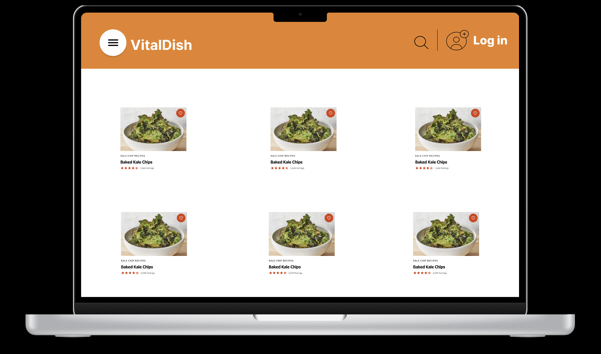
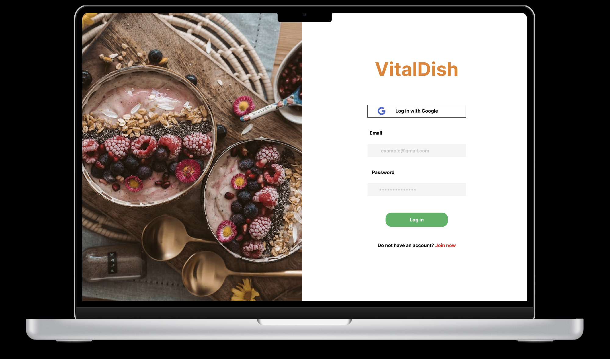
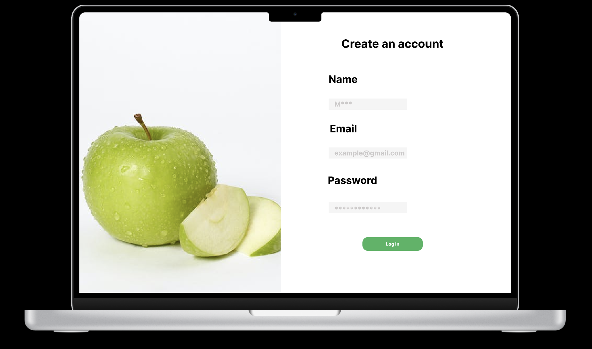
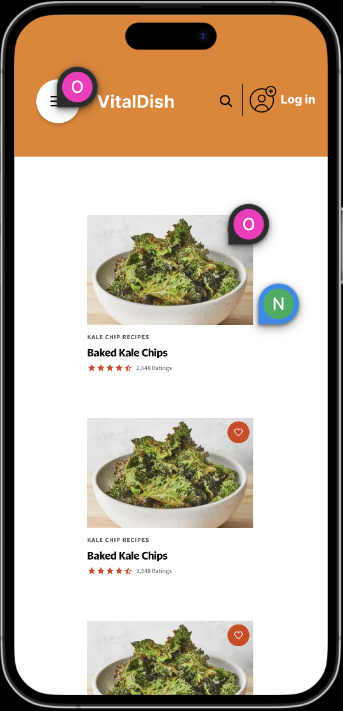
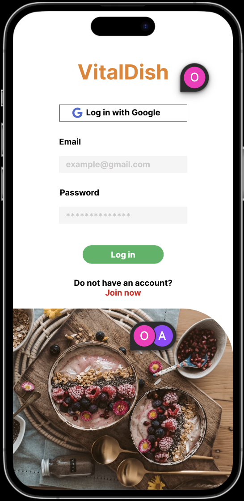
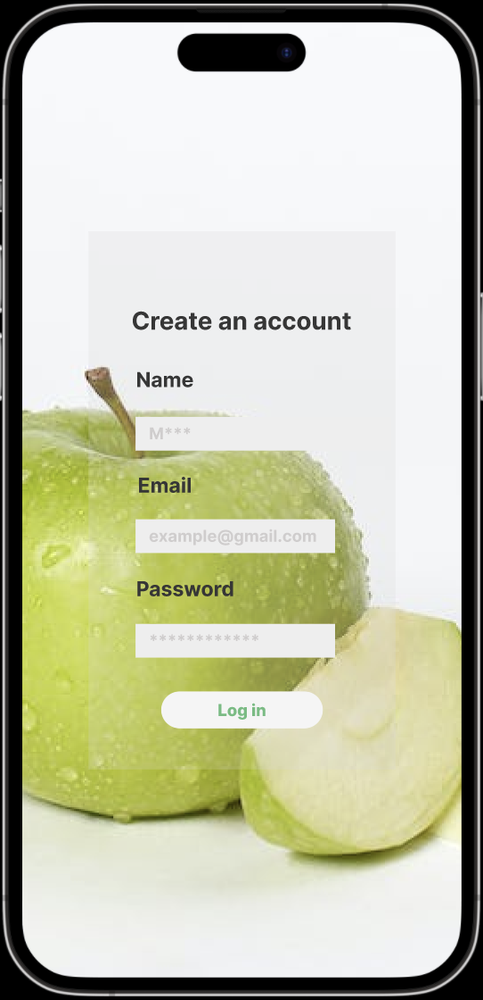

# VitalDish

## Índice

* [1. Definición del producto](#1-definición-del-producto)
* [2. Quiénes son los principales usuarios de producto.](#2-usuarios)
* [3. Qué problema resuelve el producto / para qué le servirá a estos usuarios.?](#3-resolución-de-problemas)
* [4. Funcionalidades](#4-funcionalidades)
* [5. Historias de Usuario](#5-historias-de-usuario)
* [6. Prototipos de alta fidelidad](#6-prototipo-de-alta-fidelidad)
* [7. Resultados de test de usuabilidad](#7-test-usabilidad)
* [8. Planificación del Proyecto](#8-planificación-del-proyecto)

## 1. Definición del producto

En la actualidad, la salud y la nutrición han cobrado una importancia sin precedentes. Cada vez más personas buscan adoptar estilos de vida saludables, pero con la rutina diaria y el constante bombardeo de opciones de comida rápida, puede ser un desafío preparar comidas nutritivas en casa. Aquí es donde entra mi aplicación.

Creada con pasión y compromiso, esta aplicación es el resultado de mi deseo personal de contribuir a una comunidad más saludable y consciente. A través de una interfaz sencilla y amigable, los usuarios pueden descubrir, compartir y discutir recetas que no sólo son deliciosas, sino también nutritivas. Pero no es solo una aplicación de recetas; es una comunidad, un espacio para aprender, inspirarse y comprometerse con una alimentación saludable.

¡Espero que disfrutes de esta plataforma tanto como yo disfruté creándola!

### Características Principales:

1. **Registro y Acceso:** Cualquier persona puede crear una cuenta y acceder con ella para ser parte activa de la comunidad.
2. **Interactividad:** Los usuarios pueden crear, editar y borrar publicaciones relacionadas con recetas saludables. Además, si te gusta alguna receta en particular, ¡puedes mostrar tu aprecio dándole "like"!
3. **Single-page Application (SPA):** Mi plataforma es una aplicación de una sola página que es responsive, asegurando una experiencia fluida y adaptable a cualquier dispositivo.

## 2. Quiénes son los principales usuarios de producto.

* ***Entusiastas de la Salud:*** Individuos que están constantemente buscando mejorar su estilo de vida a través de la alimentación. Estas personas pueden estar interesadas en encontrar nuevas recetas saludables, compartir las suyas y discutir sobre ingredientes y técnicas de cocina.

* ***Principiantes en la Cocina:*** Aquellas personas que quizás no tengan mucha experiencia cocinando pero desean aprender y buscan recetas sencillas y saludables para empezar.

* ***Deportistas y Fitness:*** Aquellos que llevan un régimen de entrenamiento y buscan comidas que se alineen con sus objetivos físicos y nutricionales.

* ***Personas con Condiciones de Salud Específicas:*** Individuos que, por razones de salud, necesitan seguir una dieta específica y están en busca de recetas que se ajusten a sus necesidades.

* ***Vegetarianos, Veganos y Otros Regímenes Alimenticios:*** Personas que siguen dietas específicas y buscan diversificar sus platos mientras mantienen sus principios alimenticios.

* ***Familias:*** Padres y madres que buscan preparar comidas saludables para sus hijos y toda la familia.

* ***Personas en Transición a un Estilo de Vida Saludable:*** Aquellos que han decidido hacer cambios en su dieta y estilo de vida y buscan una comunidad y recursos para apoyar ese cambio.

## 3. Qué problema resuelve el producto / para qué le servirá a estos usuarios?

* ***Falta de Inspiración para Cocinar Saludable:*** Uno de los mayores desafíos al tratar de comer sano es no caer en la monotonía. Mi aplicación proporciona a los usuarios una variedad de recetas saludables, evitando que se aburran y abandonen su objetivo de alimentarse bien.

* ***Desconocimiento Nutricional:*** No todas las personas tienen conocimientos sobre nutrición. Al proveer detalles nutricionales de cada receta, mi aplicación educa a los usuarios sobre lo que consumen, ayudándoles a tomar decisiones informadas.

* ***Dificultad en Encontrar Recetas Específicas:*** Personas con dietas o necesidades específicas (como veganos, celíacos o diabéticos) a menudo tienen dificultades en encontrar recetas que se adapten a sus requerimientos. Mi plataforma podría ofrecer filtros o categorías que simplifiquen esta búsqueda.

* ***Necesidad de Comunidad y Soporte:*** Adoptar o mantener un estilo de vida saludable puede ser desafiante. Al permitir a los usuarios compartir, comentar y "likear" recetas, se crea una comunidad donde pueden apoyarse mutuamente, compartir consejos y motivarse.

* ***Ahorro de Tiempo:*** En la era digital, la gente busca soluciones rápidas y fáciles. En lugar de pasar horas buscando recetas en diferentes sitios web o libros, mi aplicación centraliza esta información, ahorrándoles tiempo.

* ***Transición a Hábitos Saludables:*** Para aquellos en transición a un estilo de vida más saludable, mi aplicación sirve como una herramienta integral, ofreciendo recursos, comunidad y conocimiento en un solo lugar.

En resumen, mi producto sirve como un recurso integral para aquellos que buscan llevar una vida más saludable a través de la alimentación. Facilita la búsqueda y adaptación de recetas, educa en aspectos nutricionales, fomenta una comunidad de apoyo y ayuda en la transición y mantenimiento de hábitos alimenticios saludables.

## 4. Funcionalidades

1. Registro de Usuario:

* Permite a los nuevos usuarios crear una cuenta con una dirección de correo electrónico y contraseña.

2. Autenticación de Usuario:

* Permite a los usuarios existentes ingresar a su cuenta utilizando su correo electrónico y contraseña.

3. Filtros:

* Filtrar recetas según diferentes sabores (dulce, salado, dulce y salado).
* Opción de filtrar según el momento del día o tipo de comida (desayuno, almuerzo, cena, snack).

4. Búsqueda:

* Capacidad de buscar por nombre de receta.

5. Detalle Completo de Receta:

* Al seleccionar el título de una receta, se accede a una página detallada.
* Visualización de ingredientes necesarios y cantidades.
* Instrucciones paso a paso.

6. Interacción:

* Los usuarios pueden dar "like" o reaccionar a las recetas.
* Sección de comentarios donde los usuarios pueden compartir sus experiencias, modificaciones o preguntas sobre la receta.
* Posibilidad de editar o eliminar sus propios comentarios.

### Cómo usar la aplicación

1. Comienza tu experiencia accediendo a la aplicación [aquí](https://moonlit-pasca-e1a4fa.netlify.app)
2. Una vez dentro, descubrirás una gama de recetas. Sin embargo, para interactuar más a fondo con ellas (como ver detalles, comentar o dar 'like'), necesitarás iniciar sesión. 
3. Si eres nuevo en la plataforma, dirígete a la sección de registro. Introduce tu nombre, dirección de correo electrónico y una contraseña. Al completar el registro con éxito, serás redireccionado a la página de inicio de sesión.
4. Después de iniciar sesión, podrás acceder a la totalidad de la experiencia. Haz clic en el título de cualquier receta para descubrir más sobre ella. 
5. Si una receta te captura, muestra tu aprecio con un 'like' haciendo clic en el icono del corazón.
6. Comparte tus pensamientos o dudas usando el icono de la nube para comentar. 
7. Al seleccionar "View all comments", podrás observar todas las opiniones de la comunidad. Si el comentario es de tu autoría, tendrás opciones para editar o eliminar tu aporte.
8. En la esquina superior izquierda, encontrarás un ícono de menú tipo hamburguesa. Al hacer clic, se despliega un menú lateral que te permite filtrar recetas por sabores y momentos del día, adaptándose a tus gustos.
9. ¿Buscas algo específico? Utiliza el campo de búsqueda en la esquina superior derecha para localizar recetas por nombre. 
10. Cuando desees concluir tu experiencia, simplemente haz clic en el ícono de cerrar sesión.

### Diseño de la página

#### Selección Cromática

Para VitalDish, decidí apostar por esta gama cromática debido a:

* Su resonancia con la temática saludable y fresca de nuestros platos.
* La habilidad para destacar y complementar visualmente el contenido nutritivo.
* El equilibrio sofisticado y depurado que transmite a cada usuario.
* El contraste armónico que facilita una experiencia de lectura agradable.

### Tipografía utilizada

Se quizo transmitir sensaciones como frescura, naturaleza, bienestar y autenticidad, utilizando 'Times New Roman', Times, serif para todo el contenido de la aplicación.

### Iconografía

Se utilizaron algunos íconos en el proyecto, la cual fueron tomados de la siguiente página:

[Iconos](https://fontawesome.com/)

### Tecnologías utilizadas

En el desarrollo de este proyecto, se empleo las piedras angulares del desarrollo web moderno: `JavaScript`, `HTML` y `CSS`. Estas herramientas, cada una con un propósito específico, confluyen para generar sitios web que no solo son visualmente atractivos sino también interactivos y funcionales.

***HTML (HyperText Markup Language)*** actúa como el esqueleto de una página web, proporcionando la estructura básica. Es el lenguaje de marcado con el que definimos y organizamos los elementos esenciales, como encabezados, párrafos, imágenes y enlaces.

***CSS (Cascading Style Sheets)*** es el alma artística detrás de la web, encargándose de la estética y el diseño visual. A través de CSS, especificamos estilos, colores, fuentes, espaciado y la disposición general de los elementos HTML, asegurando una presentación visualmente armoniosa y atractiva.

***JavaScript*** es el motor que impulsa la interacción y dinamismo de un sitio web. Es el lenguaje que nos permite crear acciones reactivas a eventos del usuario, modificar estilos al vuelo, validar formularios y, entre otras cosas, interactuar con servicios web para ofrecer contenido fresco y actual.

Al entrelazar estas tres tecnologías, **JavaScript**, **HTML** y **CSS**, logramos una infraestructura robusta para el diseño web. Mientras que JavaScript otorga interactividad y dinamismo, HTML y CSS trabajan en tándem para estructurar y embellecer el contenido.

Además, en este proyecto se incorporó el uso del **Local Storage**. Esta característica fue esencial dado que el objetivo era permitir a los usuarios registrarse, iniciar sesión, comentar, editar, dar 'likes' y eliminar comentarios en el contexto de una Aplicación de Página Única (SPA, por sus siglas en inglés). El Local Storage permitió almacenar y recuperar la información del usuario de manera eficiente y sin necesidad de una base de datos externa.

### Control de versiones

Se ha utilizado Git como sistema de control de versiones para mantener un registro detallado de los cambios realizados en el proyecto.

## 5. Historias de Usuario

### 5.1 Historia de Usuario #1 - Inicio de Sesión

***Como usuario*** de "VitalDish",
***Quiero*** poder iniciar sesión en la aplicación,
***Para*** acceder a una variedad de recetas saludables personalizadas según mis preferencias.

### Criterios de Aceptación

* Cuando el usuario entra en la aplicación, debo ver una opción para iniciar sesión.
* Debe de poder iniciar sesión utilizando su correo electrónico y contraseña.
* Si todavía el usuario no ha registrado en la página, podrá crear una cuenta con su correo electrónico y crear una contraseña.
* Si ingreso la información de inicio de sesión incorrectamente, debe de recibir un mensaje de error, comunicandole que su usuario ó contraseña es inválida.
* Si ingreso la información de inicio de sesión correctamente, deberá ser dirigido a la página principal con las recetas.

### Definición de terminado

* La página de inicio de sesión es parte de una aplicación de una sola página (SPA).
* La página de inicio de sesión es responsive y se ve bien en diferentes tamaños de pantalla.
* Se han realizado pruebas unitarias para validar la funcionalidad y se han corregido todos los errores identificados.
* Se han realizado pruebas manuales para identificar y corregir errores e imperfecciones.
* Se han realizado pruebas de usabilidad y se ha incorporado el feedback de los usuarios para mejorar la interfaz y experiencia de usuario.
* La aplicación con la funcionalidad de inicio de sesión ha sido desplegada y se ha etiquetado la versión correspondiente con git tag.

### 5.2 Historia de Usuario #1 - Muro/timeline

***Como usuario*** de "VitalDish",
***Quiero*** poder crear un post, editar, eliminar y dar like a las recetas,
***Para*** poder hacer un aporte a la comunidad de vitalDish. 

### Criterios de Aceptación

1. Validaciones:

* Al publicar, se debe validar que exista contenido en el input.

2. Comportamiento:

* Al recargar la aplicación, se debe verificar si el usuario está logueado antes de mostrar contenido.
* Poder dar like a cada receta.
* Poder publicar un post.
* Poder eliminar un post específico.
* Pedir confirmación antes de eliminar un post.
* Al dar click para editar un post, debe cambiar el texto por un input que permita editar el texto y luego guardar los cambios.
* Al guardar los cambios debe cambiar de vuelta a un texto normal pero con la información editada.
* Al recargar la página debo de poder ver los textos editados.

### Definición de terminado

* Debe ser una SPA.
* Debe ser responsive.
* Test unitarios
* Se testeo manualmente buscando errores e imperfecciones simples.
* Pruebas de usabilidad e incorporaron el feedback de los usuarios como mejoras.
* Despliegue de la aplicación

## 6. Prototipos de alta fidelidad

Con su respectivo feedback

* [Figma-Desktop](https://www.figma.com/proto/C4ZQz1gC8XzDlheNG8OGiP/desktop?type=design&node-id=1-2&t=rsTzCCANzCPOGsRc-0&scaling=scale-down&page-id=0%3A1&starting-point-node-id=1%3A2)

* [Figma-Mobile](https://www.figma.com/proto/dCSQtBhl2q1pOESS8XgF14/Social-Network-VitalDish?type=design&node-id=15-170&t=3YwoEtraIU1lDoMD-0&scaling=scale-down&page-id=0%3A1)

## 7. Resultados de test de usuabilidad

El principal objetivo de los tests de usabilidad era evaluar tanto la facilidad de uso como la experiencia del usuario en la plataforma, **VitalDish**. Con la intención de obtener una evaluación detallada, invité a un grupo diverso de usuarios para que interactuaran con las características principales de la plataforma. Se les pidió que realizaran tareas específicas relacionadas con la exploración de platos saludables, la interacción con comentarios, dar 'likes', editar y eliminar opiniones, y el proceso de registro y login, todo ello bajo el formato de una SPA (Single Page Application).

El feedback que se obtuvo fue fundamental. La cual permitió ver cómo los usuarios se adentraban en la experiencia de descubrir platos saludables, cómo se sentían al interactuar con los comentarios y las posibles dificultades o puntos de fricción que encontraban durante su navegación. Esta retroalimentación proporcionó un mapa claro de las áreas en las que se puede optimizar y mejorar.

Usando la versión auténtica de **VitalDish** durante las pruebas, se garantizo feedback directo y tangible. Las reacciones y observaciones de los participantes dieron una comprensión profunda de las áreas que requerían atención y refinamiento, permitiéndo realizar ajustes en aspectos como el diseño, la navegabilidad y la interactividad.

Para llevar a cabo estas pruebas, se empleo la herramienta Jotform: [VitalDish Test](https://form.jotform.com/232341518753051), diseñada específicamente para evaluar y capturar la experiencia del usuario en nuestra plataforma.

#### Las preguntas realizadas fueron:

1. ¿Fue fácil acceder a la aplicación a través del enlace proporcionado?
2. Una vez dentro de la aplicación, ¿te resultó claro que necesitabas iniciar sesión para acceder a ciertas funcionalidades?
3. ¿Te resultó claro cómo registrarte en la plataforma?
4. ¿El proceso de registro e inicio de sesión fue intuitivo y fluido?
5. Después de iniciar sesión, ¿sentiste que se desbloquearon más funcionalidades?
6. ¿Fue fácil acceder a los detalles de una receta haciendo clic en su título?
7. ¿Lograste identificar y usar el icono del corazón para dar 'like' a una receta?
8. ¿Cómo fue tu experiencia al comentar en una receta utilizando el icono de la nube?
9. ¿Fue sencillo encontrar y hacer clic en "View all comments"?. Si dejaste un comentario, ¿te resultó claro cómo editarlo o eliminarlo?
10. ¿Qué opinas sobre el ícono de menú tipo hamburguesa en la esquina superior izquierda? ¿Fue fácil de identificar y usar?. Al desplegar este menú, ¿te parecieron adecuadas las opciones de filtrado por sabores y momentos del día?
11. ¿Encontraste fácilmente el ícono para cerrar sesión?. ¿El proceso de cerrar sesión fue sencillo y claro?
12. General: ¿Hay alguna funcionalidad que te haya parecido complicada o poco intuitiva?¿Qué funcionalidad te pareció la más útil o la que más te gustó?¿Tienes alguna sugerencia o comentario adicional sobre la plataforma?

Dando un [reporte](https://www.jotform.com/report/23234674124304823?st=WFdRUDMxT25NYXY1VXNHYUZsUmlhMVIrYnJETG1MZWVUZVVzc3Q2VTVnZUdicFl6NG9PY1M5WjlISi9UeFVGUTFuODJVVmdncUdWekY5U1VURll6cllSTktRMlhkQmZuUDJoNDNpUG91YWs5alBlMW9LSTIwZlUyZzVwNmRscXM=) detallado.

## 8. Planificación del Proyecto

Una de las claves fundamentales para el éxito de nuestro proyecto "VitalDish" ha sido una planificación meticulosa y una gestión efectiva de las tareas. Para alcanzar este nivel de organización, me apoye en la potente herramienta que ofrece GitHub: GitHub Project.

Empece dividiendo todo el trabajo en tareas específicas, lo cual me permitió tener una visión granular de todos los componentes del proyecto y las etapas requeridas para su implementación. Estas tareas se organizaban inicialmente bajo la columna "Todo", que funcionaba como un repositorio de todas las acciones pendientes, permitiéndo identificar claramente los pasos iniciales y futuros.

A medida de que comenzaba a trabajar en cada tarea, estas se movían a la columna "In Process". Esto no solo me proporcionaba una visualización clara del progreso en tiempo real, sino que también permitía evitar duplicar tareas.

Finalmente, una vez completadas, las tareas se trasladaban a la columna "Done". Esta transición representaba un hito significativo y era un recordatorio constante de los logros y avances hacia la finalización del proyecto.

Usar GitHub Project para "VitalDish" optimizó la eficiencia y productividad.
